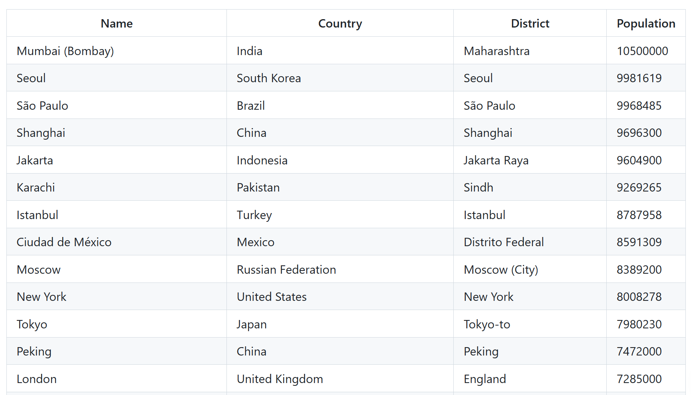
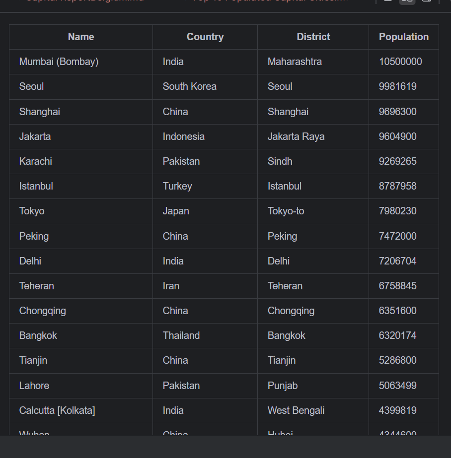
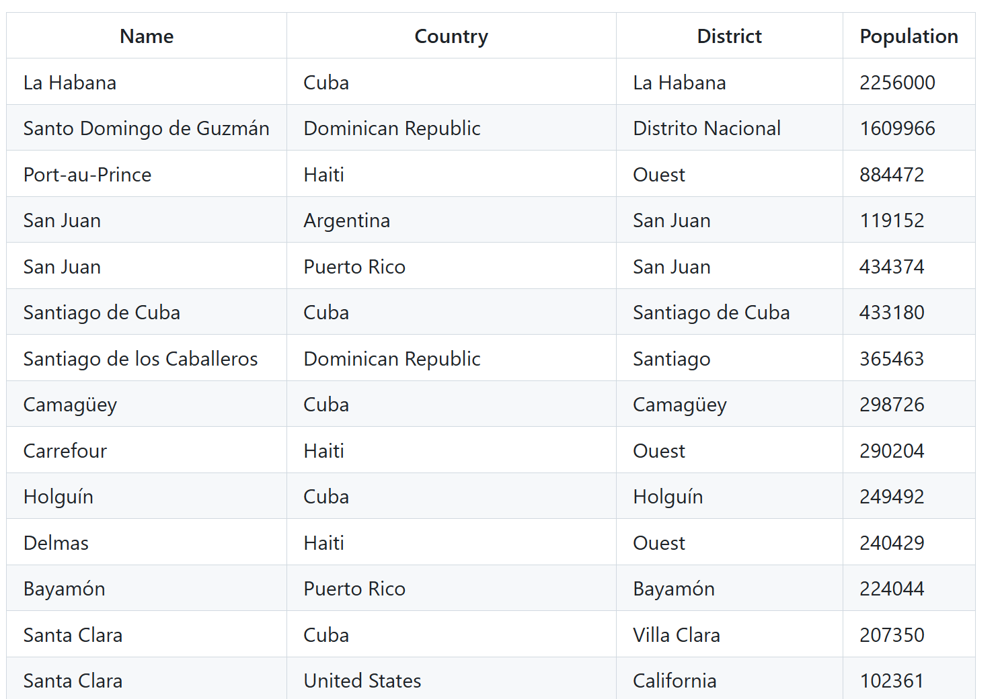
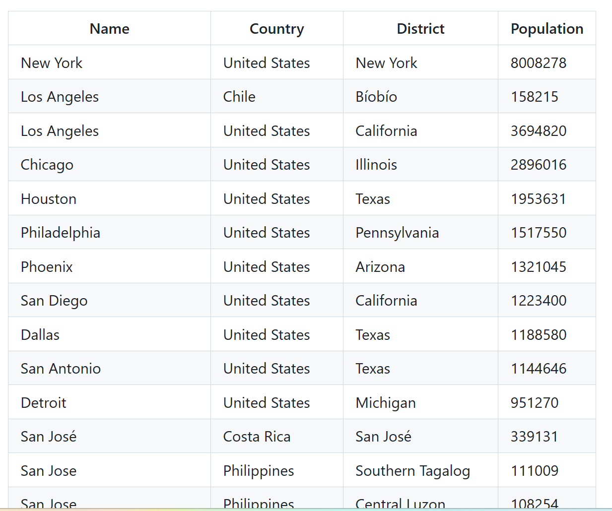
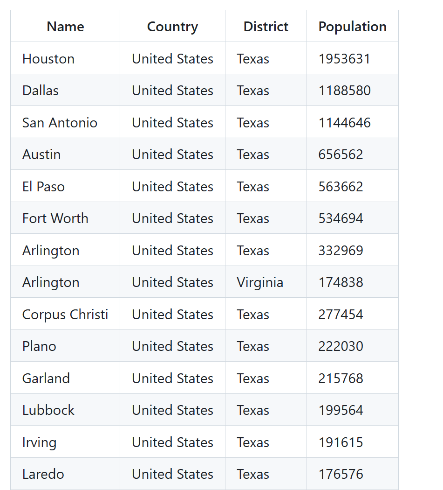
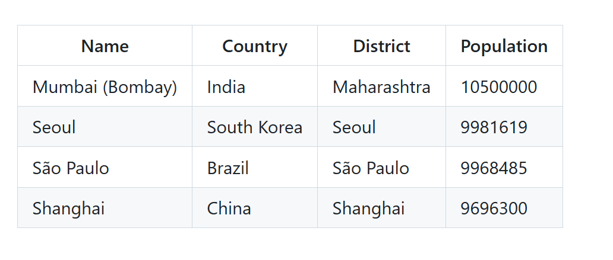
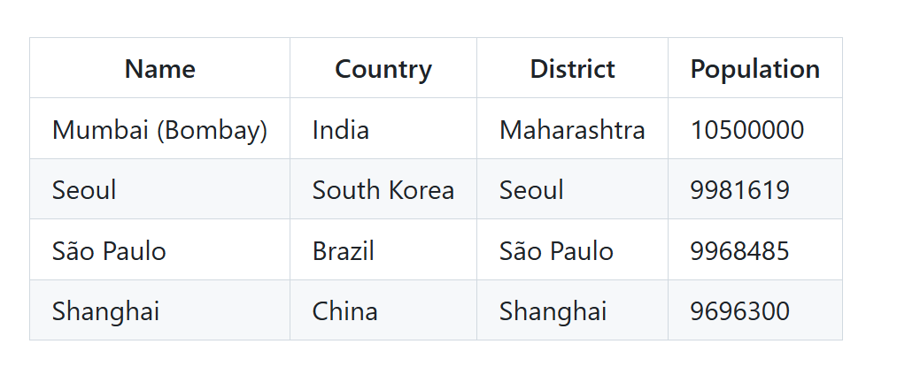
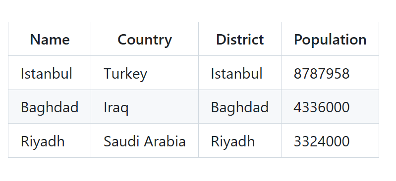
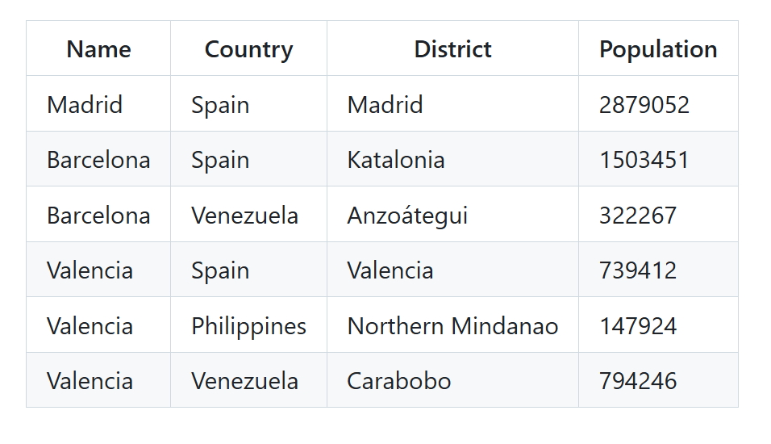

# Software Engineering Methods Team 38
## By Lewis S, Declan K, Gastão B and Mateusz W

### Badges
* Main Build Status 
* Develop Branch Status 
* License 
* Release 
* Code Coverage 

### Requirements Met

| ID | Name                                                                                                                                       | Met  | Screenshot               |
|----|--------------------------------------------------------------------------------------------------------------------------------------------|------|--------------------------|
| 1  | All the countries in the world organised by largest population to smallest.                                                                |      |                          |
| 2  | All the countries in a continent organised by largest population to smallest.                                                              |      |                          |
| 3  | All the countries in a region organised by largest population to smallest.                                                                 |      |                          |
| 4  | The top N populated countries in the world where N is provided by the user.                                                                |      |                          |
| 5  | The top N populated countries in a continent where N is provided by the user.                                                              |      |                          |
| 6  | The top N populated countries in a region where N is provided by the user.                                                                 |      |                          |
| 7  | All the cities in the world organised by largest population to smallest.                                                                   | Yes  |   |
| 8  | All the cities in a continent organised by largest population to smallest.                                                                 | Yes  |       |
| 9  | All the cities in a region organised by largest population to smallest.                                                                    | Yes  |   |
| 10 | All the cities in a country organised by largest population to smallest.                                                                   | Yes  |   |
| 11 | All the cities in a district organised by largest population to smallest.                                                                  | Yes  |   |
| 12 | The top N populated cities in the world where N is provided by the user.                                                                   | Yes  |   |
| 13 | The top N populated cities in a continent where N is provided by the user.                                                                 | Yes  |   |
| 14 | The top N populated cities in a region where N is provided by the user.                                                                    | Yes  |   |
| 15 | The top N populated cities in a country where N is provided by the user.                                                                   | Yes  |   |
| 16 | The top N populated cities in a district where N is provided by the user.                                                                  | Yes  |   |
| 17 | All the capital cities in the world organised by largest population to smallest.                                                           |      |                          |
| 18 | All the capital cities in a continent organised by largest population to smallest.                                                         |      |                          |
| 19 | All the capital cities in a region organised by largest to smallest.                                                                       |      |                          |
| 20 | The top N populated capital cities in the world where N is provided by the user.                                                           |      |                          |
| 21 | The top N populated capital cities in a continent where N is provided by the user.                                                         |      |                          |
| 22 | The top N populated capital cities in a region where N is provided by the user.                                                            |      |                          |
| 23 | The population of people, people living in cities, and people not living in cities in each continent.                                      |      |                          |
| 24 | The population of people, people living in cities, and people not living in cities in each region.                                         |      |                          |
| 25 | The population of people, people living in cities, and people not living in cities in each country.                                        |      |                          |
| 26 | The population of the world.                                                                                                               |      |                          |
| 27 | The population of a continent.                                                                                                             |      |                          |
| 28 | The population of a region.                                                                                                                |      |                          |
| 29 | The population of a country.                                                                                                               |      |                          |
| 30 | The population of a district.                                                                                                              |      |                          |
| 31 | The population of a city.                                                                                                                  |      |                          |
| 32 | number of people who speak the following the following languages from greatest number to smallest Chinese, English, Hindi, Spanish, Arabic |      |                          |